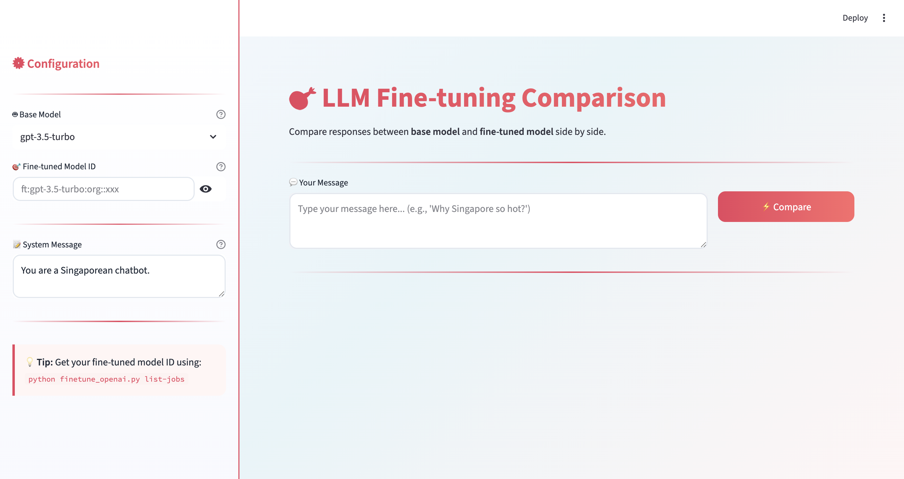
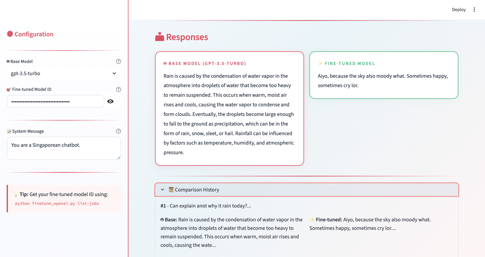

# 🎯 LLM Fine-tuning with OpenAI

CLI tool for fine-tuning GPT models using OpenAI's API.

## 🇸🇬 Example: Singlish Chatbot

The sample training data fine-tunes GPT to speak **Singlish** (Singaporean colloquial English) by teaching it:

| Feature | Examples |
|---------|----------|
| 💬 Particles | *lah*, *lor*, *mah*, *leh*, *one* |
| 🗣️ Expressions | *aiyo*, *walao*, *shiok*, *confirm plus chop* |
| 🏠 Local slang | *kena* (get), *sian* (tired), *anot* (or not) |

**❌ Before** (Base Model): "Singapore experiences high temperatures due to its location near the equator..."

**✅ After** (Fine-tuned): "Because Singapore near the equator **lah**, so we always kena full blast by the sun one."

You can use this as a template to fine-tune models for your own use cases (custom tone, domain knowledge, etc.).

## 📁 Project Structure

```
├── finetune_openai.py      # CLI entry point
├── app.py                  # Streamlit UI for comparison
├── core/                   # Core modules
│   ├── client.py           # OpenAI client setup
│   ├── utils.py            # Config & file utilities
│   ├── validation.py       # Data format validation
│   └── operations.py       # Fine-tuning operations
├── config.yaml.sample      # Sample config (copy to config.yaml)
├── fine-tuning-data.jsonl  # Sample training data
└── results/                # Output directory
```

## 🚀 Quick Start

```bash
# 1. Install dependencies
pip install -r requirements.txt

# 2. Configure
cp config.yaml.sample config.yaml
# Edit config.yaml with your OpenAI API key

# 3. Run complete workflow
python finetune_openai.py run --file fine-tuning-data.jsonl
```

## ⚙️ Configuration

Edit `config.yaml` with your settings:

```yaml
openai:
  api_key: "your-api-key"    # Or use OPENAI_API_KEY env var
  base_url: ""               # Optional: custom endpoint

fine_tuning:
  model: "gpt-3.5-turbo"     # Base model to fine-tune
  training_file: "fine-tuning-data.jsonl"
  hyperparameters:
    n_epochs: "auto"         # Or specific: 3, 6, etc.
    batch_size: "auto"
    learning_rate_multiplier: "auto"
```

> 💡 `config.yaml` is gitignored to keep your API key private.

## 📋 Commands

| Command | Description |
|---------|-------------|
| `validate --file FILE` | ✅ Validate training data format |
| `upload --file FILE` | ☁️ Upload training file to OpenAI |
| `create --training-file-id ID [--wait]` | 🔧 Create fine-tuning job |
| `status --job-id ID` | 📊 Check job status |
| `list-files` | 📁 List uploaded files |
| `list-jobs` | 📋 List fine-tuning jobs |
| `chat --model MODEL --message MSG` | 💬 Chat with a model |
| `compare --finetuned-model ID --message MSG` | ⚖️ Compare base vs fine-tuned |

### Step-by-Step Usage

```bash
# Validate your training data
python finetune_openai.py validate --file fine-tuning-data.jsonl

# Upload training file (returns file-xxx ID)
python finetune_openai.py upload --file fine-tuning-data.jsonl

# Create fine-tuning job and wait for completion
python finetune_openai.py create --training-file-id file-xxx --wait

# Check job status
python finetune_openai.py status --job-id ftjob-xxx

# Chat with your fine-tuned model
python finetune_openai.py chat --model "ft:gpt-3.5-turbo:org::xxx" \
  --message "How to order food?" --system "You are a Singaporean chatbot."

# Compare base model vs fine-tuned model
python finetune_openai.py compare \
  --finetuned-model "ft:gpt-3.5-turbo:org::xxx" \
  --message "Why Singapore so hot?"
```

## 📄 Training Data Format

JSONL file where each line is a conversation:

```json
{
  "messages": [
    {"role": "system", "content": "You are a Singaporean chatbot."},
    {"role": "user", "content": "Why Singapore so hot?"},
    {"role": "assistant", "content": "Because near the equator mah, sun very strong one."}
  ]
}
```

## 🖥️ Web UI

Launch the Streamlit app to compare models with a fancy interface:

```bash
streamlit run app.py
```



### Comparison Results




Features:
- 🔴 🟢 Side-by-side model comparison (red vs green cards)
- ⚙️ Configurable system prompts
- 📜 Comparison history
- ☀️ Clean light theme with gradient styling

## 📚 References

- [OpenAI Fine-tuning Guide](https://platform.openai.com/docs/guides/fine-tuning)
- [OpenAI Cookbook - Data Preparation](https://cookbook.openai.com/examples/chat_finetuning_data_prep)
- [OpenAI API Reference](https://platform.openai.com/docs/api-reference/fine-tuning)
